<link rel="stylesheet" type="text/css" href="gallery.css" />

<h1>Gallery</h1>

  

Andorra (`AD`)

  

United Arab Emirates (`AE`)

  
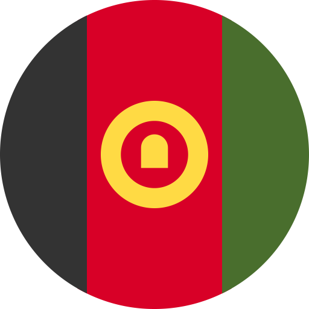
Afghanistan (`AF`)

  

Antigua and Barbuda (`AG`)

  

Anguilla (`AI`)

  

Albania (`AL`)

  
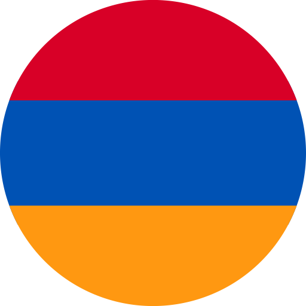
Armenia (`AM`)

  

Angola (`AO`)

  

Antarctica (`AQ`)

  

Argentina (`AR`)

  

American Samoa (`AS`)

  
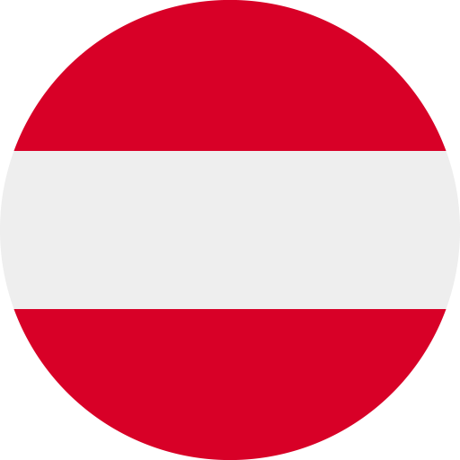
Austria (`AT`)

  

Australia (`AU`)

  

Aruba (`AW`)

  
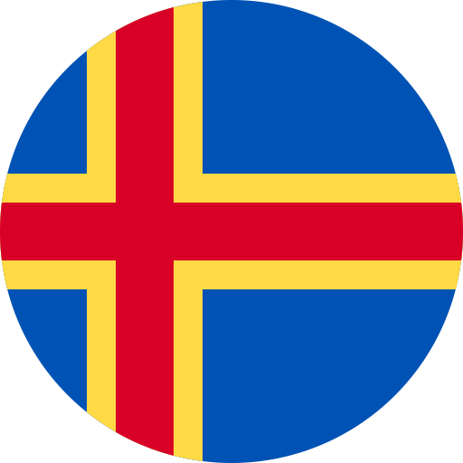
Åland Islands (`AX`)

  

Azerbaijan (`AZ`)

  

Bosnia and Herzegovina (`BA`)

  
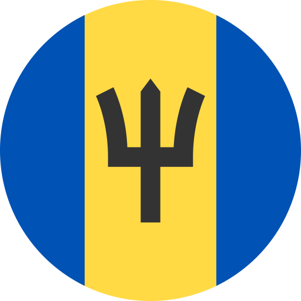
Barbados (`BB`)

  

Bangladesh (`BD`)

  

Belgium (`BE`)

  

Burkina Faso (`BF`)

  

Bulgaria (`BG`)

  

Bahrain (`BH`)

  

Burundi (`BI`)

  

Benin (`BJ`)

  

Saint Barthélemy (`BL`)

  
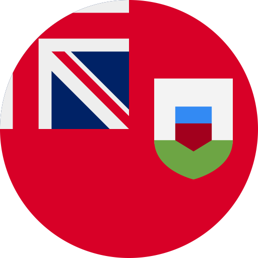
Bermuda (`BM`)

  
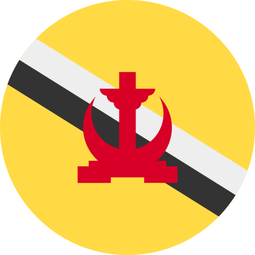
Brunei (`BN`)

  
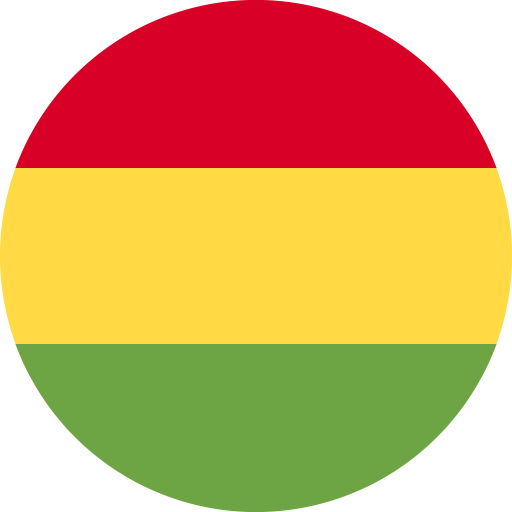
Bolivia (`BO`)

  

Bonaire (`BQ-BO`)

  

Saba (`BQ-SA`)

  

Sint Eustatius (`BQ-SE`)

  

Brazil (`BR`)

  

Bahamas (`BS`)

  

Bhutan (`BT`)

  

Bouvet Island (`BV`)

  

Botswana (`BW`)

  

Belarus (`BY`)

  

Belize (`BZ`)

  

British Columbia

  

Canada (`CA`)

  

Cocos (Keeling) Islands (`CC`)

  

Congo, Democratic Republic of the (`CD`)

  

Central African Republic (`CF`)

  

Congo (`CG`)

  

Switzerland (`CH`)

  

Ivory Coast (`CI`)

  

Cook Islands (`CK`)

  

Chile (`CL`)

  

Cameroon (`CM`)

  

China (`CN`)

  

Colombia (`CO`)

  

Costa Rica (`CR`)

  
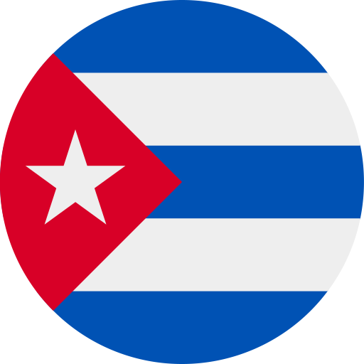
Cuba (`CU`)

  

Cabo Verde (`CV`)

  

Curaçao (`CW`)

  

Christmas Island (`CX`)

  

Cyprus (`CY`)

  

Czechia (`CZ`)

  

Germany (`DE`)

  

Djibouti (`DJ`)

  

Denmark (`DK`)

  

Dominica (`DM`)

  
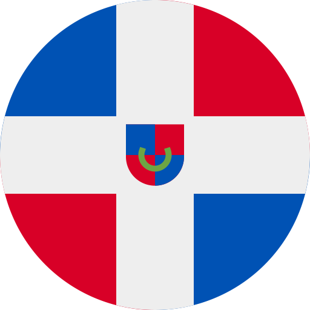
Dominican Republic (`DO`)

  

Algeria (`DZ`)

  

Easter Island

  
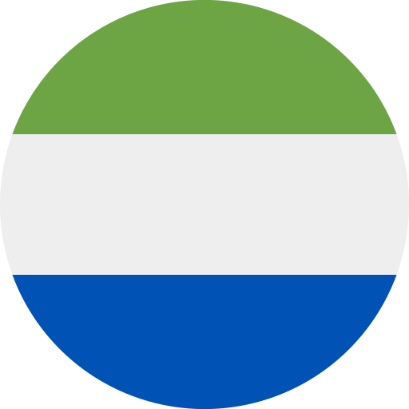
Galápagos

  

Ecuador (`EC`)

  

Estonia (`EE`)

  

Egypt (`EG`)

  

Western Sahara (`EH`)

  
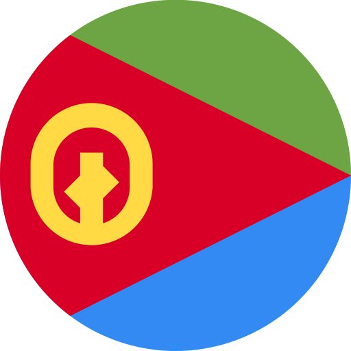
Eritrea (`ER`)

  

Ceuta

  

Canary Islands

  

Galicia

  

Balearic Islands

  

Melilla

  

Basque Country

  

Spain (`ES`)

  

Esperanto

  

Ethiopia (`ET`)

  

European Union

  

Finland (`FI`)

  

Fiji (`FJ`)

  

Falkland Islands (Malvinas) (`FK`)

  

Micronesia (`FM`)

  
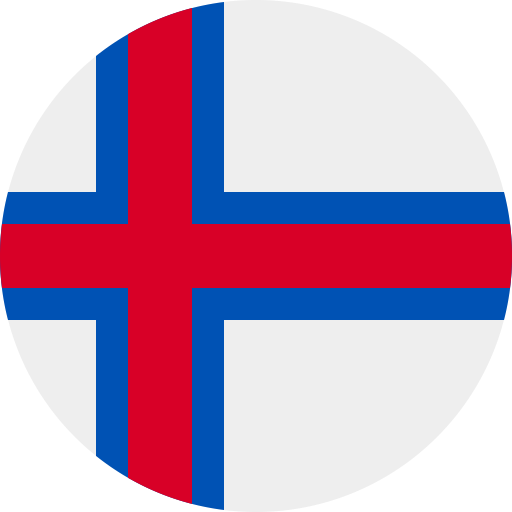
Faroe Islands (`FO`)

  

Corsica

  
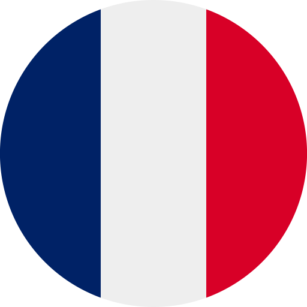
France (`FR`)

  
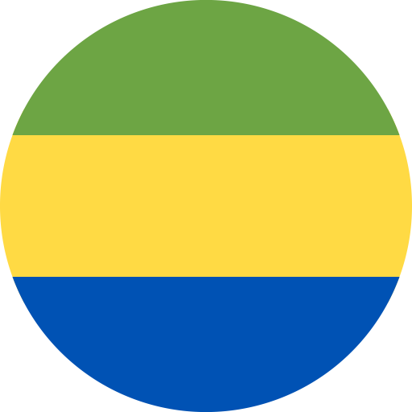
Gabon (`GA`)

  

England

  

Orkney

  

Scotland

  

Wales

  

United Kingdom (`GB`)

  

Grenada (`GD`)

  

Georgia (`GE`)

  
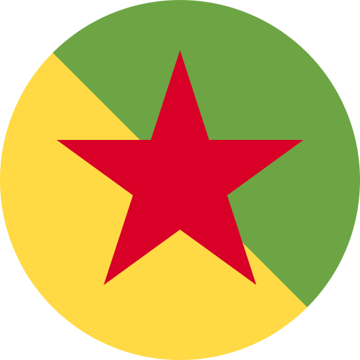
French Guiana (`GF`)

  

Guernsey (`GG`)

  

Ghana (`GH`)

  

Gibraltar (`GI`)

  

Greenland (`GL`)

  

Gambia (`GM`)

  

Guinea (`GN`)

  

Guadeloupe (`GP`)

  

Equatorial Guinea (`GQ`)

  

Greece (`GR`)

  

South Georgia and the South Sandwich Islands (`GS`)

  

Guatemala (`GT`)

  

Guam (`GU`)

  

Guinea-Bissau (`GW`)

  

Guyana (`GY`)

  

Hausa

  

Hong Kong (`HK`)

  

Hmong

  

Heard Island and McDonald Islands (`HM`)

  

Honduras (`HN`)

  

Croatia (`HR`)

  

Haiti (`HT`)

  
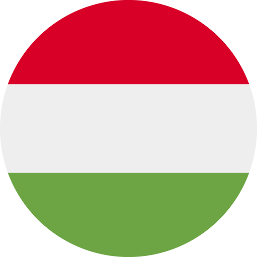
Hungary (`HU`)

  

Indonesia (`ID`)

  

Ireland (`IE`)

  

Israel (`IL`)

  

Isle of Man (`IM`)

  

India (`IN`)

  

British Indian Ocean Territory (`IO`)

  

Iraq (`IQ`)

  

Iran (`IR`)

  
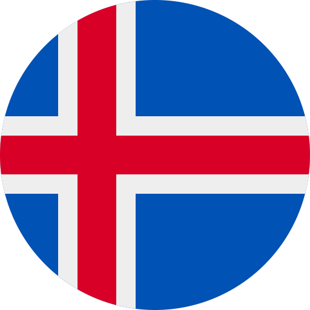
Iceland (`IS`)

  

Sicily

  

Sardinia

  
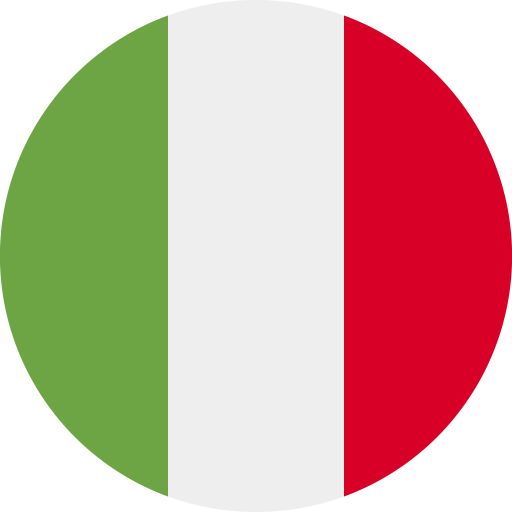
Italy (`IT`)

  

Jersey (`JE`)

  
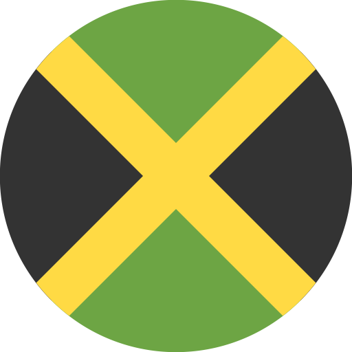
Jamaica (`JM`)

  

Jordan (`JO`)

  

Japan (`JP`)

  
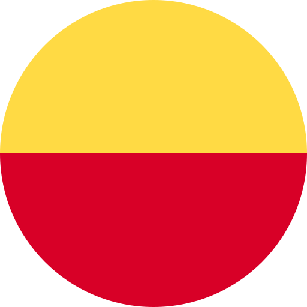
Kannada

  

Kenya (`KE`)

  

Kyrgyzstan (`KG`)

  
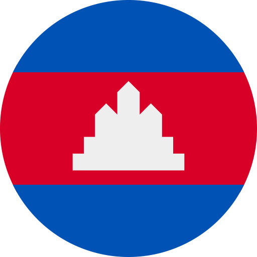
Cambodia (`KH`)

  
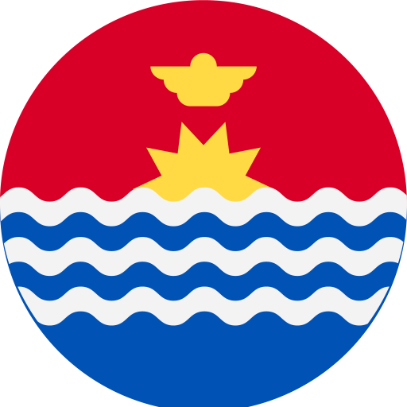
Kiribati (`KI`)

  
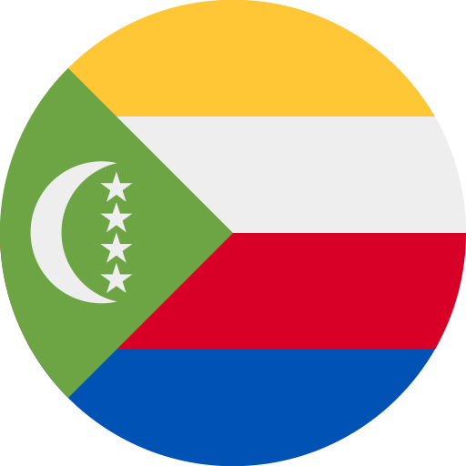
Comoros (`KM`)

  

Saint Kitts and Nevis (`KN`)

  

North Korea (`KP`)

  

South Korea (`KR`)

  

Kurdistan

  

Kuwait (`KW`)

  

Cayman Islands (`KY`)

  

Kazakhstan (`KZ`)

  
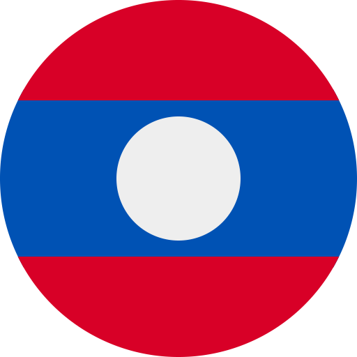
Laos (`LA`)

  

Lebanon (`LB`)

  

Saint Lucia (`LC`)

  

Liechtenstein (`LI`)

  

Sri Lanka (`LK`)

  

Liberia (`LR`)

  

Lesotho (`LS`)

  

Lithuania (`LT`)

  

Luxembourg (`LU`)

  

Latvia (`LV`)

  

Libya (`LY`)

  

Morocco (`MA`)

  

Malayali

  
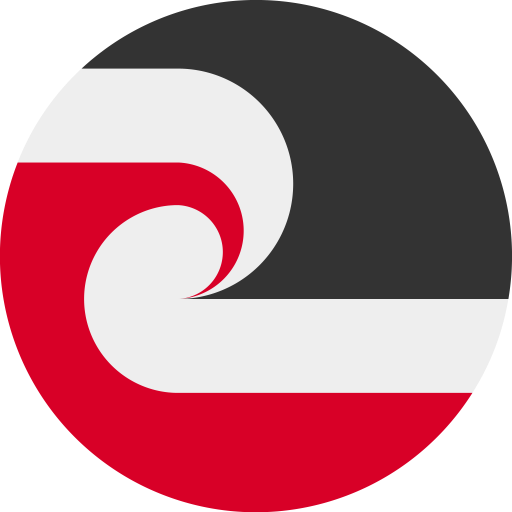
Maori

  
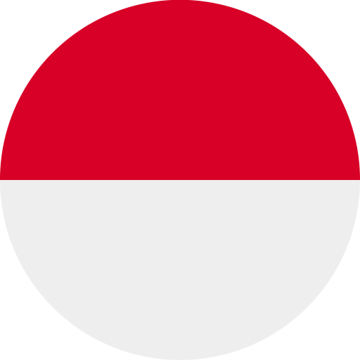
Monaco (`MC`)

  
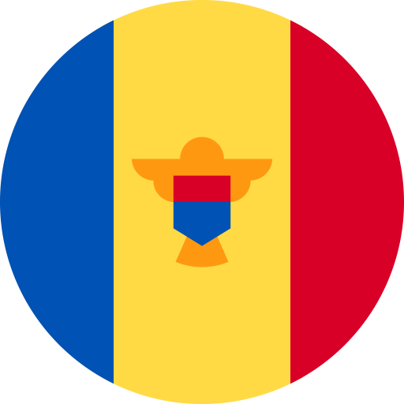
Moldova (`MD`)

  

Montenegro (`ME`)

  

Saint-Martin (`MF`)

  

Madagascar (`MG`)

  

Marshall Islands (`MH`)

  

North Macedonia (`MK`)

  
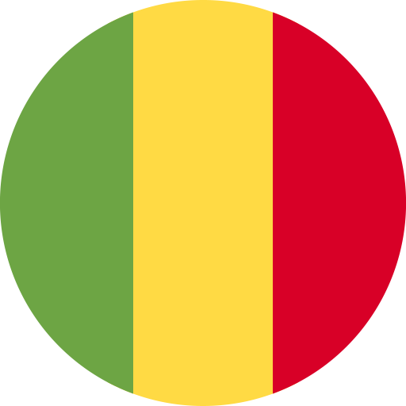
Mali (`ML`)

  

Myanmar (`MM`)

  

Mongolia (`MN`)

  

Macao (`MO`)

  

Northern Mariana Islands (`MP`)

  

Martinique (`MQ`)

  
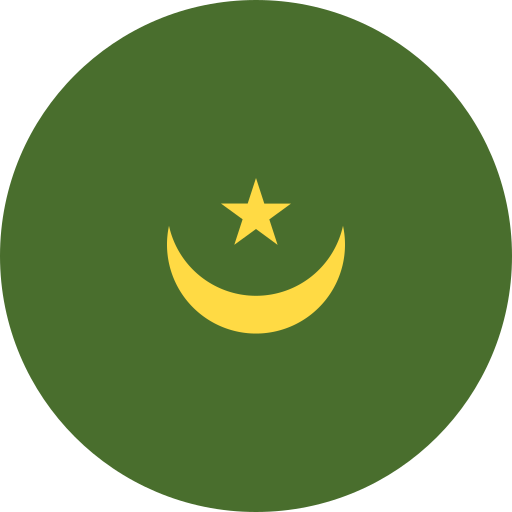
Mauritania (`MR`)

  

Montserrat (`MS`)

  

Malta (`MT`)

  

Mauritius (`MU`)

  

Maldives (`MV`)

  

Malawi (`MW`)

  

Mexico (`MX`)

  

Malaysia (`MY`)

  

Mozambique (`MZ`)

  
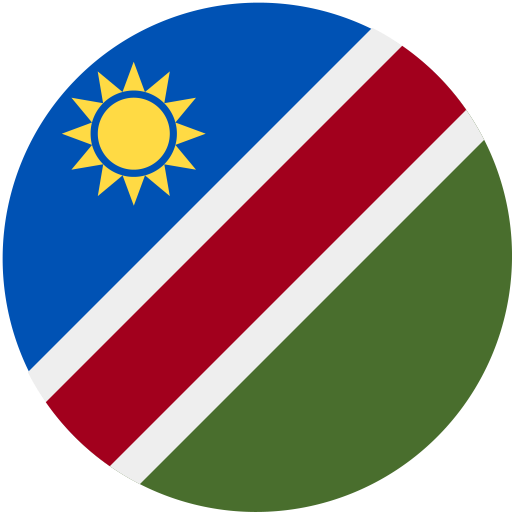
Namibia (`NA`)

  

New Caledonia (`NC`)

  

NATO

  

Niger (`NE`)

  

Norfolk Island (`NF`)

  

Nigeria (`NG`)

  

Nicaragua (`NI`)

  
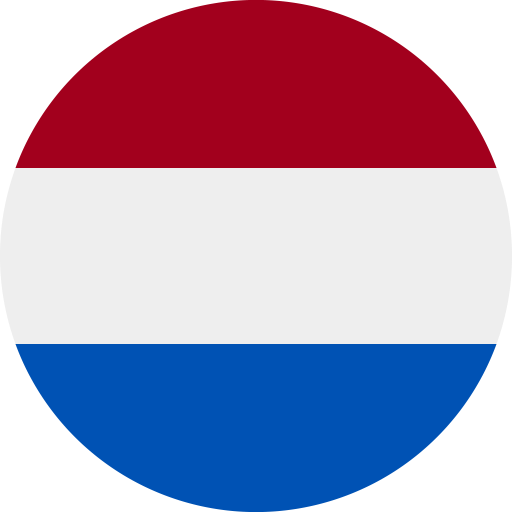
Netherlands (`NL`)

  

Norway (`NO`)

  
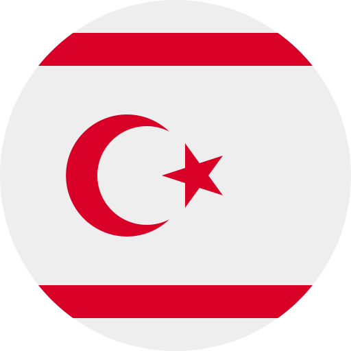
Northern Cyprus

  

Nepal (`NP`)

  
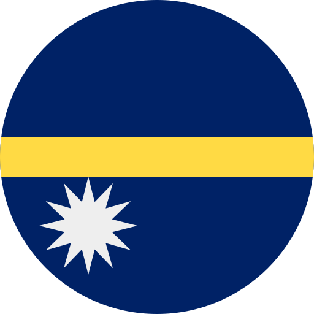
Nauru (`NR`)

  
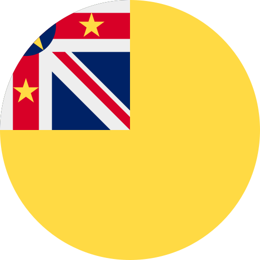
Niue (`NU`)

  

New Zealand (`NZ`)

  

Oman (`OM`)

  

Panama (`PA`)

  

Peru (`PE`)

  

French Polynesia (`PF`)

  

Papua New Guinea (`PG`)

  

Philippines (`PH`)

  

Pakistan (`PK`)

  

Poland (`PL`)

  

Saint Pierre and Miquelon (`PM`)

  
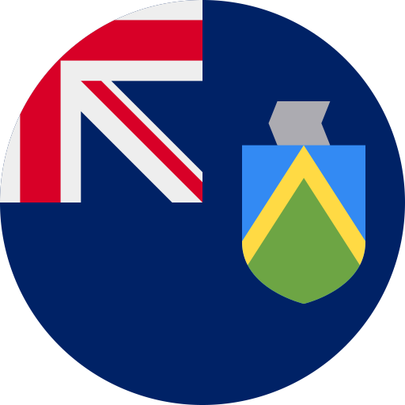
Pitcairn Islands (`PN`)

  

Puerto Rico (`PR`)

  

Palestine (`PS`)

  

Azores

  

Madeira

  
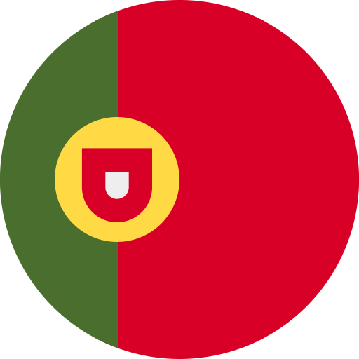
Portugal (`PT`)

  

Palau (`PW`)

  

Paraguay (`PY`)

  

Qatar (`QA`)

  
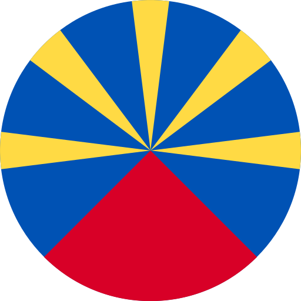
Réunion (`RE`)

  

Romania (`RO`)

  

Serbia (`RS`)

  

Russia (`RU`)

  

Rwanda (`RW`)

  

Saudi Arabia (`SA`)

  

Solomon Islands (`SB`)

  

Seychelles (`SC`)

  

Sudan (`SD`)

  

Sweden (`SE`)

  

Singapore (`SG`)

  

Saint Helena (`SH-HL`)

  

Ascension Island (`SH-AC`)

  

Tristan da Cunha (`SH-TA`)

  

Slovenia (`SI`)

  

Sindh

  

Svalbard and Jan Mayen (`SJ`)

  

Slovakia (`SK`)

  

Sierra Leone (`SL`)

  

San Marino (`SM`)

  

Senegal (`SN`)

  

Somalia (`SO`)

  

Somaliland

  

South Ossetia

  

Suriname (`SR`)

  
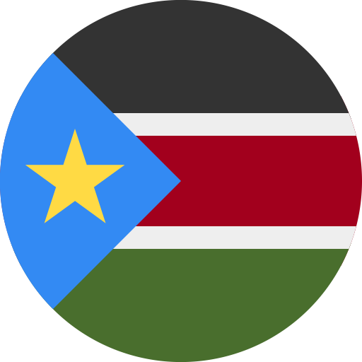
South Sudan (`SS`)

  

São Tomé and Príncipe (`ST`)

  

El Salvador (`SV`)

  

Sint Maarten (`SX`)

  

Syria (`SY`)

  

Eswatini (`SZ`)

  

Turks and Caicos Islands (`TC`)

  

Chad (`TD`)

  

French Southern Territories (`TF`)

  
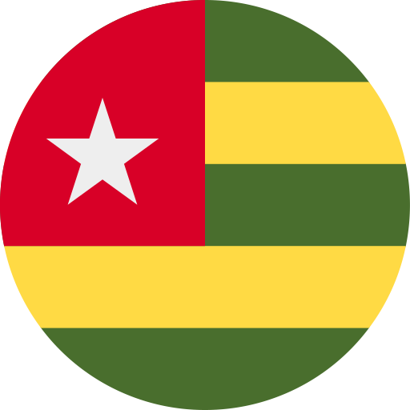
Togo (`TG`)

  

Thailand (`TH`)

  

Tibet

  

Tajikistan (`TJ`)

  

Tokelau (`TK`)

  

Timor-Leste (`TL`)

  
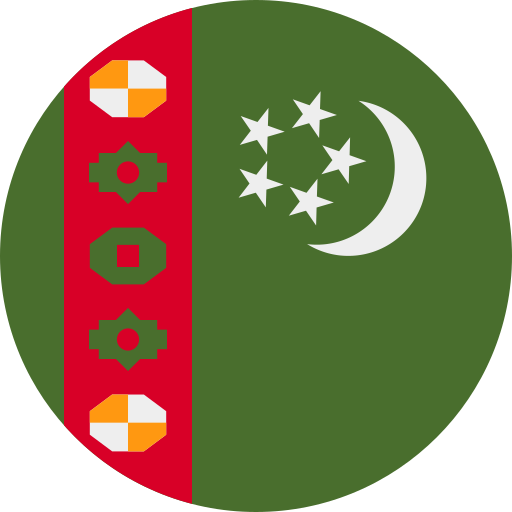
Turkmenistan (`TM`)

  

Tunisia (`TN`)

  
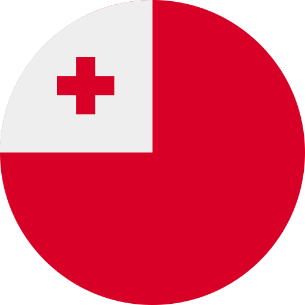
Tonga (`TO`)

  

Turkey (`TR`)

  

Transnistria

  

Trinidad and Tobago (`TT`)

  

Tuvalu (`TV`)

  

Taiwan (`TW`)

  

Tanzania (`TZ`)

  

Ukraine (`UA`)

  
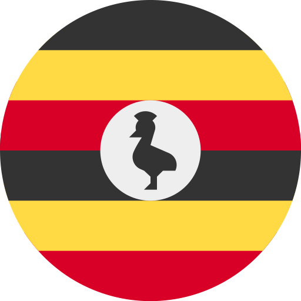
Uganda (`UG`)

  

United Nations

  
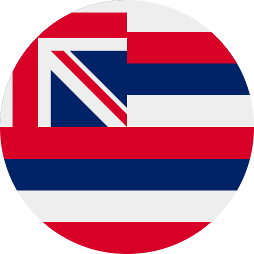
Hawaii

  

United States of America (`US`)

  

United States Minor Outlying Islands (`UM`)

  

Uruguay (`UY`)

  

Uzbekistan (`UZ`)

  

Holy See (Vatican) (`VA`)

  

Saint Vincent and the Grenadines (`VC`)

  

Venezuela (`VE`)

  

Virgin Islands (British) (`VG`)

  

Virgin Islands (U.S.) (`VI`)

  

Vietnam (`VN`)

  

Vanuatu (`VU`)

  

Wallis and Futuna (`WF`)

  

Samoa (`WS`)

  

Kosovo (`XK`)

  

&lt;Placeholder&gt;

  
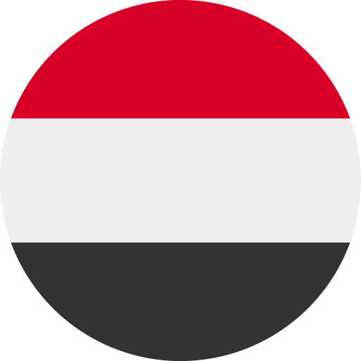
Yemen (`YE`)

  

Mayotte (`YT`)

  

Yiddish

  

South Africa (`ZA`)

  

Zambia (`ZM`)

  

Zimbabwe (`ZW`)

