<link rel="stylesheet" type="text/css" href="gallery.css" />

<h1>Gallery (square variants)</h1>

  

Andorra (<code>AD</code>)

  
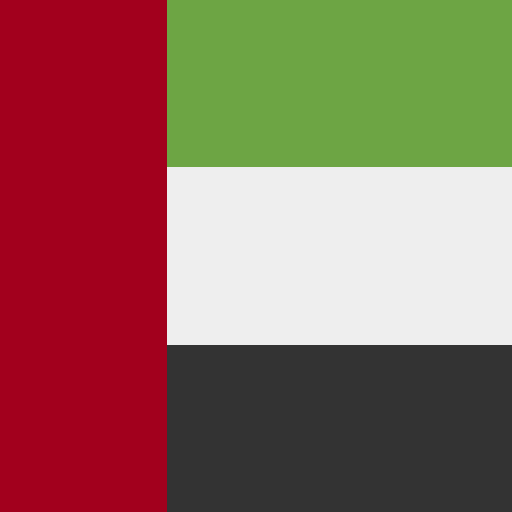
United Arab Emirates (<code>AE</code>)

  

Afghanistan (<code>AF</code>)

  

Antigua and Barbuda (<code>AG</code>)

  

Anguilla (<code>AI</code>)

  

Albania (<code>AL</code>)

  
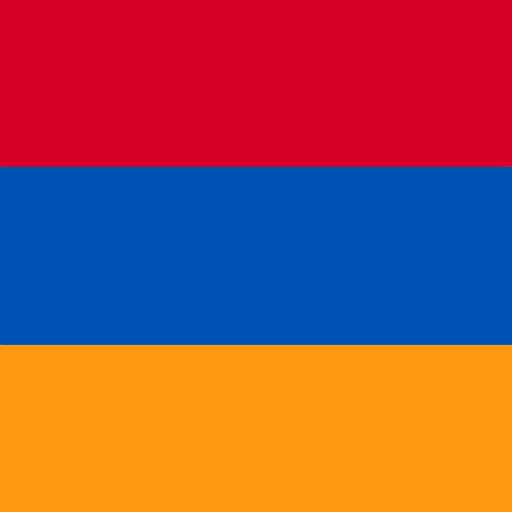
Armenia (<code>AM</code>)

  

Angola (<code>AO</code>)

  

Antarctica (<code>AQ</code>)

  

Argentina (<code>AR</code>)

  

American Samoa (<code>AS</code>)

  

Austria (<code>AT</code>)

  

Australia (<code>AU</code>)

  

Australian Aboriginal

  

Aruba (<code>AW</code>)

  

Åland Islands (<code>AX</code>)

  

Azerbaijan (<code>AZ</code>)

  
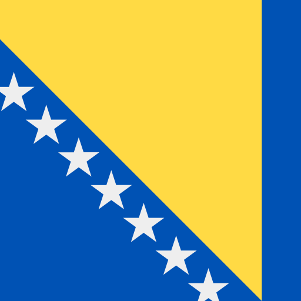
Bosnia and Herzegovina (<code>BA</code>)

  

Barbados (<code>BB</code>)

  

Bangladesh (<code>BD</code>)

  

Belgium (<code>BE</code>)

  

Burkina Faso (<code>BF</code>)

  

Bulgaria (<code>BG</code>)

  

Bahrain (<code>BH</code>)

  

Burundi (<code>BI</code>)

  

Benin (<code>BJ</code>)

  

Saint Barthélemy (<code>BL</code>)

  

Bermuda (<code>BM</code>)

  

Brunei (<code>BN</code>)

  

Bolivia (<code>BO</code>)

  

Bonaire (<code>BQ-BO</code>)

  

Saba (<code>BQ-SA</code>)

  

Sint Eustatius (<code>BQ-SE</code>)

  

Brazil (<code>BR</code>)

  

Bahamas (<code>BS</code>)

  

Bhutan (<code>BT</code>)

  

Bouvet Island (<code>BV</code>)

  

Botswana (<code>BW</code>)

  

Belarus (<code>BY</code>)

  

Belize (<code>BZ</code>)

  

Canada (<code>CA</code>)

  

British Columbia (<code>CA-BC</code>)

  

Cocos (Keeling) Islands (<code>CC</code>)

  

Congo, Democratic Republic of the (<code>CD</code>)

  

Central African Republic (<code>CF</code>)

  

Congo (<code>CG</code>)

  

Switzerland (<code>CH</code>)

  

Ivory Coast (<code>CI</code>)

  

Cook Islands (<code>CK</code>)

  
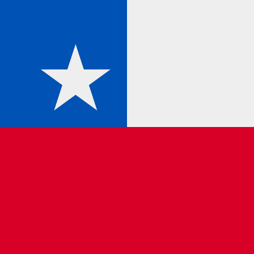
Chile (<code>CL</code>)

  

Cameroon (<code>CM</code>)

  

China (<code>CN</code>)

  

Xinjiang (<code>CN-XJ</code>)

  

Colombia (<code>CO</code>)

  

Costa Rica (<code>CR</code>)

  

Cuba (<code>CU</code>)

  

Cabo Verde (<code>CV</code>)

  

Curaçao (<code>CW</code>)

  

Christmas Island (<code>CX</code>)

  

Cyprus (<code>CY</code>)

  
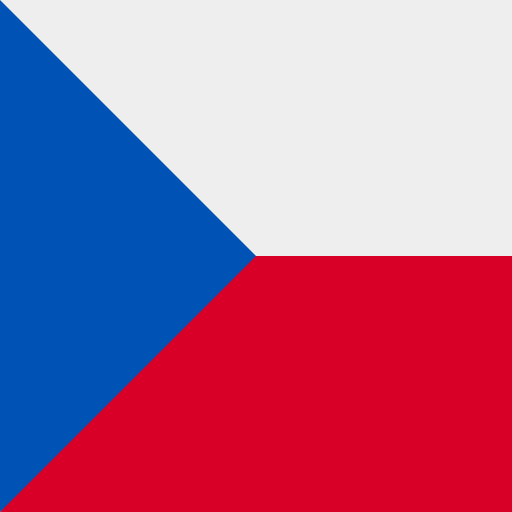
Czechia (<code>CZ</code>)

  

Germany (<code>DE</code>)

  

Djibouti (<code>DJ</code>)

  

Denmark (<code>DK</code>)

  

Dominica (<code>DM</code>)

  

Dominican Republic (<code>DO</code>)

  

Algeria (<code>DZ</code>)

  

Earth

  

East African Federation

  

Easter Island

  

Ecuador (<code>EC</code>)

  

Galápagos (<code>EC-W</code>)

  

Estonia (<code>EE</code>)

  

Egypt (<code>EG</code>)

  

Western Sahara (<code>EH</code>)

  

Eritrea (<code>ER</code>)

  

Spain (<code>ES</code>)

  

Spain

  

Catalonia (<code>ES-CT</code>)

  

Ceuta (<code>ES</code>)

  

Canary Islands (<code>ES-CN</code>)

  

Galicia (<code>ES-GA</code>)

  

Balearic Islands (<code>ES-IB</code>)

  

Melilla (<code>ES-ML</code>)

  

Basque Country (<code>ES-PV</code>)

  

Ethiopia (<code>ET</code>)

  

European Union (<code>EU</code>)

  
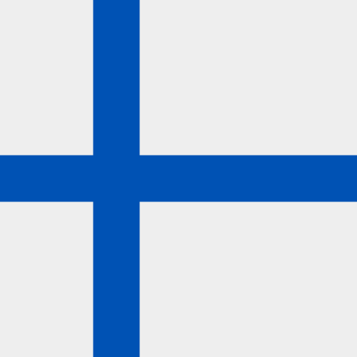
Finland (<code>FI</code>)

  

Fiji (<code>FJ</code>)

  

Falkland Islands (Malvinas) (<code>FK</code>)

  

Micronesia (<code>FM</code>)

  

Faroe Islands (<code>FO</code>)

  

France (<code>FR</code>)

  

Corsica (<code>FR-20R</code>)

  

Gabon (<code>GA</code>)

  

United Kingdom (<code>GB</code>)

  

England (<code>GB-ENG</code>)

  

Northern Ireland (<code>GB-NIR</code>)

  

Orkney (<code>GB-ORK</code>)

  

Scotland (<code>GB-SCT</code>)

  

Wales (<code>GB-WLS</code>)

  

Grenada (<code>GD</code>)

  

Georgia (<code>GE</code>)

  

Abkhazia (<code>GE-AB</code>)

  

French Guiana (<code>GF</code>)

  
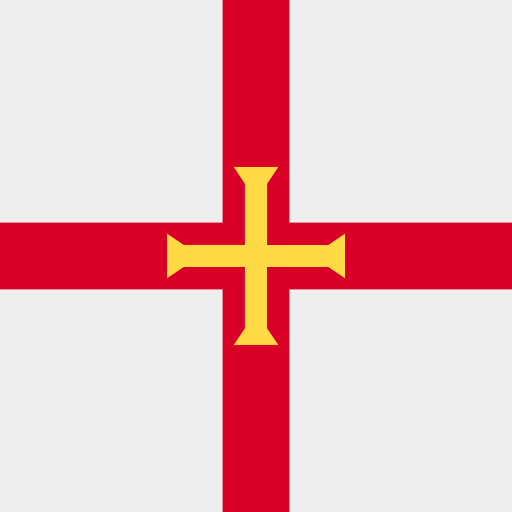
Guernsey (<code>GG</code>)

  

Ghana (<code>GH</code>)

  
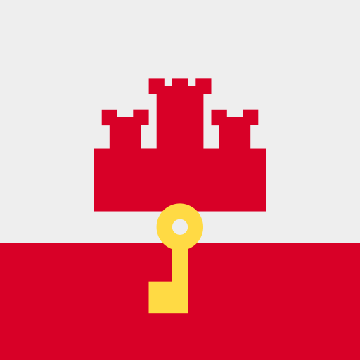
Gibraltar (<code>GI</code>)

  

Greenland (<code>GL</code>)

  

Gambia (<code>GM</code>)

  
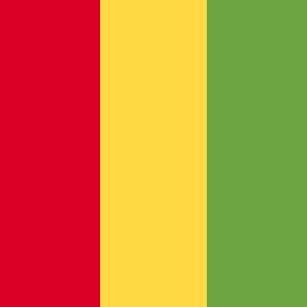
Guinea (<code>GN</code>)

  

Guadeloupe (<code>GP</code>)

  

Equatorial Guinea (<code>GQ</code>)

  
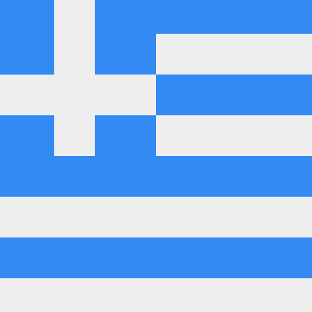
Greece (<code>GR</code>)

  

South Georgia and the South Sandwich Islands (<code>GS</code>)

  

Guatemala (<code>GT</code>)

  

Guam (<code>GU</code>)

  

Guinea-Bissau (<code>GW</code>)

  

Guyana (<code>GY</code>)

  

Hausa

  

Hong Kong (<code>HK</code>)

  

Hmong

  

Heard Island and McDonald Islands (<code>HM</code>)

  

Honduras (<code>HN</code>)

  

Croatia (<code>HR</code>)

  

Haiti (<code>HT</code>)

  

Hungary (<code>HU</code>)

  

Indonesia (<code>ID</code>)

  

West Java (<code>ID-JB</code>)

  

Central Java (<code>ID-JT</code>)

  

Ireland (<code>IE</code>)

  

Israel (<code>IL</code>)

  

Isle of Man (<code>IM</code>)

  

India (<code>IN</code>)

  

Gujarat (<code>IN-GJ</code>)

  

Karnataka (<code>IN-KA</code>)

  

Odisha (<code>IN-OR</code>)

  

Tamil Nadu (<code>IN-TN</code>)

  

British Indian Ocean Territory (<code>IO</code>)

  

Iraq (<code>IQ</code>)

  

Iran (<code>IR</code>)

  

Iceland (<code>IS</code>)

  

Italy (<code>IT</code>)

  

Sicily (<code>IT-82</code>)

  

Sardinia (<code>IT-88</code>)

  

Jersey (<code>JE</code>)

  

Jamaica (<code>JM</code>)

  

Jordan (<code>JO</code>)

  

Japan (<code>JP</code>)

  

Kenya (<code>KE</code>)

  

Kyrgyzstan (<code>KG</code>)

  

Cambodia (<code>KH</code>)

  

Kiribati (<code>KI</code>)

  

Comoros (<code>KM</code>)

  

Saint Kitts and Nevis (<code>KN</code>)

  

North Korea (<code>KP</code>)

  

South Korea (<code>KR</code>)

  

Kurdistan

  

Kuwait (<code>KW</code>)

  

Cayman Islands (<code>KY</code>)

  

Kazakhstan (<code>KZ</code>)

  

Laos (<code>LA</code>)

  

Lebanon (<code>LB</code>)

  

Saint Lucia (<code>LC</code>)

  

Liechtenstein (<code>LI</code>)

  

Sri Lanka (<code>LK</code>)

  

Liberia (<code>LR</code>)

  

Lesotho (<code>LS</code>)

  

Lithuania (<code>LT</code>)

  

Luxembourg (<code>LU</code>)

  

Latvia (<code>LV</code>)

  

Libya (<code>LY</code>)

  

Morocco (<code>MA</code>)

  

Malayali

  

Maori

  

Monaco (<code>MC</code>)

  

Moldova (<code>MD</code>)

  

Montenegro (<code>ME</code>)

  

Saint-Martin (<code>MF</code>)

  

Madagascar (<code>MG</code>)

  

Marshall Islands (<code>MH</code>)

  

North Macedonia (<code>MK</code>)

  

Mali (<code>ML</code>)

  

Myanmar (<code>MM</code>)

  

Mongolia (<code>MN</code>)

  

Macao (<code>MO</code>)

  

Northern Mariana Islands (<code>MP</code>)

  

Martinique (<code>MQ</code>)

  

Mauritania (<code>MR</code>)

  

Montserrat (<code>MS</code>)

  

Malta (<code>MT</code>)

  

Mauritius (<code>MU</code>)

  

Maldives (<code>MV</code>)

  

Malawi (<code>MW</code>)

  

Mexico (<code>MX</code>)

  
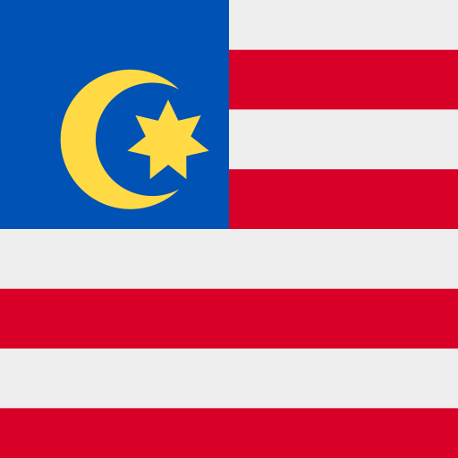
Malaysia (<code>MY</code>)

  

Mozambique (<code>MZ</code>)

  

Namibia (<code>NA</code>)

  

New Caledonia (<code>NC</code>)

  

NATO

  

Niger (<code>NE</code>)

  

Norfolk Island (<code>NF</code>)

  

Nigeria (<code>NG</code>)

  

Nicaragua (<code>NI</code>)

  

Netherlands (<code>NL</code>)

  

Friesland (<code>NL-FR</code>)

  

Norway (<code>NO</code>)

  

Northern Cyprus

  

Nepal (<code>NP</code>)

  

Nauru (<code>NR</code>)

  

Niue (<code>NU</code>)

  

New Zealand (<code>NZ</code>)

  

Olympics

  

Oman (<code>OM</code>)

  

Panama (<code>PA</code>)

  

Peru (<code>PE</code>)

  

French Polynesia (<code>PF</code>)

  

Papua New Guinea (<code>PG</code>)

  

Philippines (<code>PH</code>)

  

Pakistan (<code>PK</code>)

  

Sindh (<code>PK-SD</code>)

  

Poland (<code>PL</code>)

  

Saint Pierre and Miquelon (<code>PM</code>)

  

Pitcairn Islands (<code>PN</code>)

  

Puerto Rico (<code>PR</code>)

  

Palestine (<code>PS</code>)

  

Azores (<code>PT-20</code>)

  

Madeira (<code>PT-30</code>)

  

Portugal (<code>PT</code>)

  

Palau (<code>PW</code>)

  

Paraguay (<code>PY</code>)

  
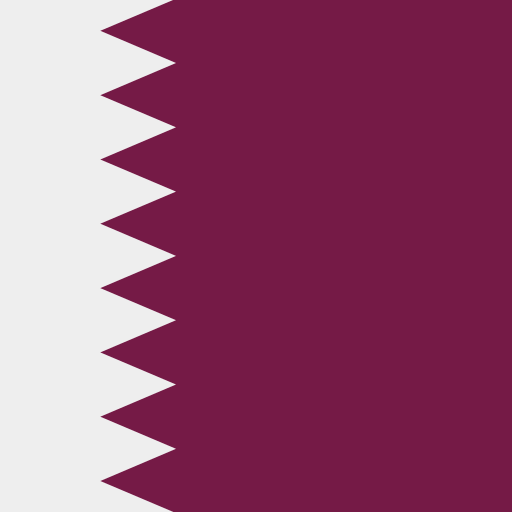
Qatar (<code>QA</code>)

  

Réunion (<code>RE</code>)

  

Romania (<code>RO</code>)

  

Serbia (<code>RS</code>)

  

Russia (<code>RU</code>)

  

Tatarstan (<code>RU-TA</code>)

  
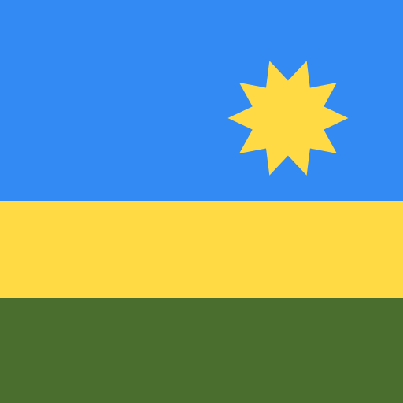
Rwanda (<code>RW</code>)

  

Saudi Arabia (<code>SA</code>)

  

Solomon Islands (<code>SB</code>)

  

Seychelles (<code>SC</code>)

  

Sudan (<code>SD</code>)

  

Sweden (<code>SE</code>)

  

Singapore (<code>SG</code>)

  

Ascension Island (<code>SH-AC</code>)

  

Saint Helena (<code>SH-HL</code>)

  

Tristan da Cunha (<code>SH-TA</code>)

  

Slovenia (<code>SI</code>)

  

Svalbard and Jan Mayen (<code>SJ</code>)

  

Slovakia (<code>SK</code>)

  

Sierra Leone (<code>SL</code>)

  

San Marino (<code>SM</code>)

  

Senegal (<code>SN</code>)

  

Somalia (<code>SO</code>)

  

Somaliland

  

South Ossetia

  

Soviet Union (<code>SU</code>)

  

Suriname (<code>SR</code>)

  

South Sudan (<code>SS</code>)

  

São Tomé and Príncipe (<code>ST</code>)

  

El Salvador (<code>SV</code>)

  

Sint Maarten (<code>SX</code>)

  

Syria (<code>SY</code>)

  

Eswatini (<code>SZ</code>)

  

Turks and Caicos Islands (<code>TC</code>)

  

Chad (<code>TD</code>)

  

French Southern Territories (<code>TF</code>)

  

Togo (<code>TG</code>)

  

Thailand (<code>TH</code>)

  

Tibet

  

Tajikistan (<code>TJ</code>)

  

Tokelau (<code>TK</code>)

  

Timor-Leste (<code>TL</code>)

  

Turkmenistan (<code>TM</code>)

  

Tunisia (<code>TN</code>)

  

Tonga (<code>TO</code>)

  
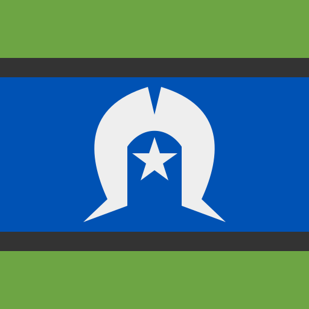
Torres Strait Islands

  

Turkey (<code>TR</code>)

  

Transnistria

  

Trinidad and Tobago (<code>TT</code>)

  

Tuvalu (<code>TV</code>)

  

Taiwan (<code>TW</code>)

  

Tanzania (<code>TZ</code>)

  

Ukraine (<code>UA</code>)

  

Uganda (<code>UG</code>)

  

United Nations (<code>UN</code>)

  

United States of America (<code>US</code>)

  

Hawaii (<code>US-HI</code>)

  

United States Minor Outlying Islands (<code>UM</code>)

  

Uruguay (<code>UY</code>)

  

Uzbekistan (<code>UZ</code>)

  

Holy See (Vatican) (<code>VA</code>)

  

Saint Vincent and the Grenadines (<code>VC</code>)

  

Venezuela (<code>VE</code>)

  

Virgin Islands (British) (<code>VG</code>)

  

Virgin Islands (U.S.) (<code>VI</code>)

  

Vietnam (<code>VN</code>)

  

Vanuatu (<code>VU</code>)

  

Wallis and Futuna (<code>WF</code>)

  

Samoa (<code>WS</code>)

  

Kosovo (<code>XK</code>)

  

&lt;Placeholder&gt;

  

Yemen (<code>YE</code>)

  

Mayotte (<code>YT</code>)

  

South Africa (<code>ZA</code>)

  

Zambia (<code>ZM</code>)

  

Zimbabwe (<code>ZW</code>)

