<link rel="stylesheet" type="text/css" href="gallery.css" />

<h1>Gallery</h1>

  

Andorra (<code>ad</code>)

  
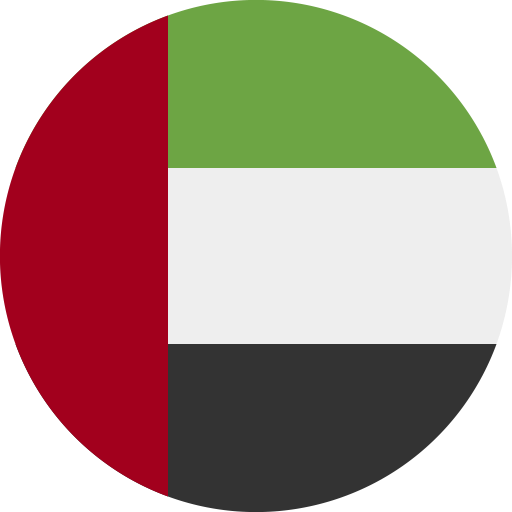
United Arab Emirates (<code>ae</code>)

  

Afghanistan (<code>af</code>)

  

Antigua and Barbuda (<code>ag</code>)

  

Anguilla (<code>ai</code>)

  

Albania (<code>al</code>)

  

Armenia (<code>am</code>)

  
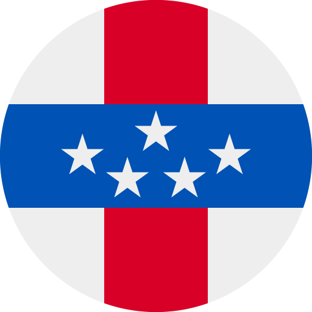
Netherlands Antilles (<code>an</code>)

  

Angola (<code>ao</code>)

  

Antarctica (<code>aq</code>)

  

Argentina (<code>ar</code>)

  
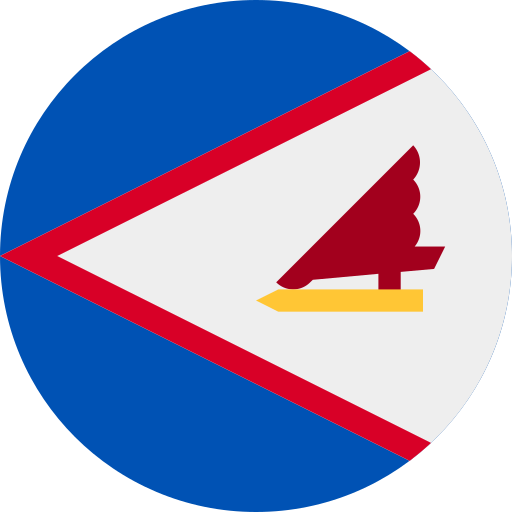
American Samoa (<code>as</code>)

  

Austria (<code>at</code>)

  

Australia (<code>au</code>)

  
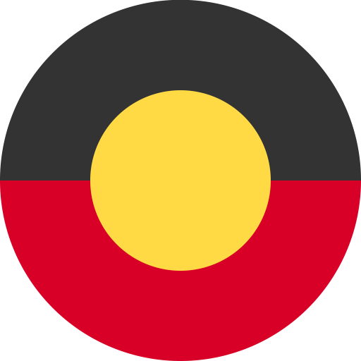
Australian Aboriginal

  
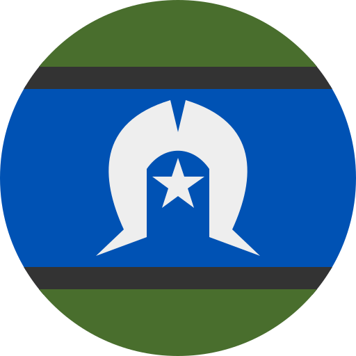
Torres Strait Islands

  

Australian Capital Territory (<code>au-act</code>)

  
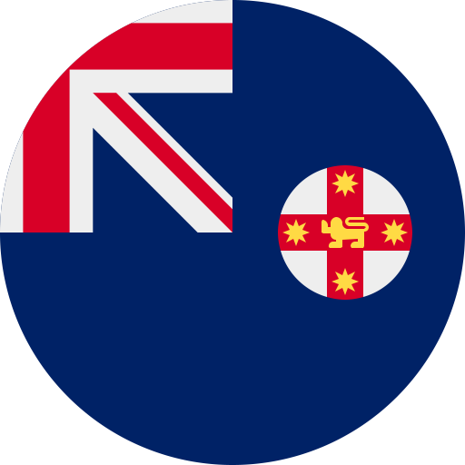
New South Wales (<code>au-nsw</code>)

  

Northern Territory (<code>au-nt</code>)

  
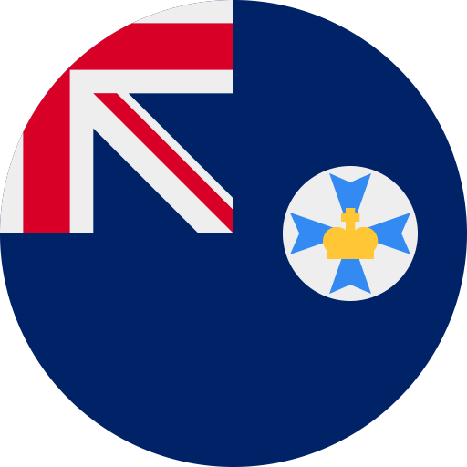
Queensland (<code>au-qld</code>)

  
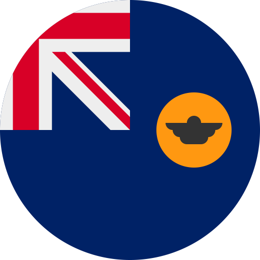
South Australia (<code>au-sa</code>)

  
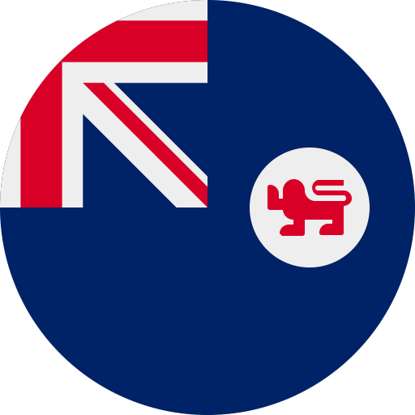
Tasmania (<code>au-tas</code>)

  
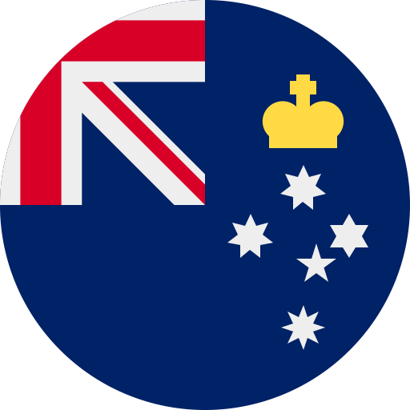
Victoria (<code>au-vic</code>)

  
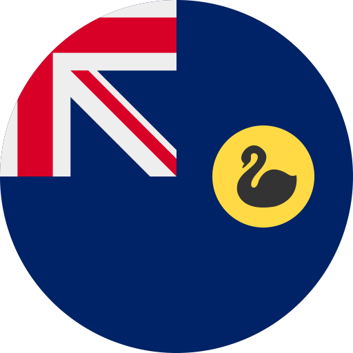
Western Australia (<code>au-wa</code>)

  

Aruba (<code>aw</code>)

  

Åland Islands (<code>ax</code>)

  
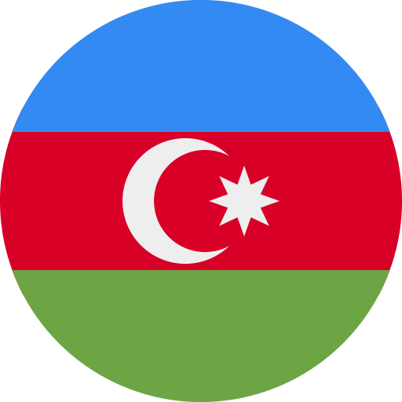
Azerbaijan (<code>az</code>)

  
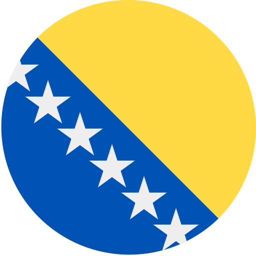
Bosnia and Herzegovina (<code>ba</code>)

  

Barbados (<code>bb</code>)

  

Bangladesh (<code>bd</code>)

  

Belgium (<code>be</code>)

  
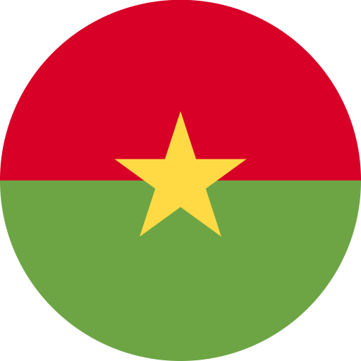
Burkina Faso (<code>bf</code>)

  
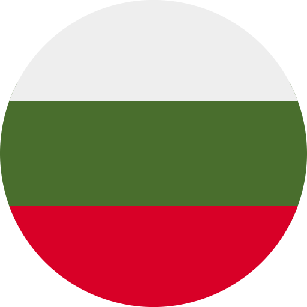
Bulgaria (<code>bg</code>)

  
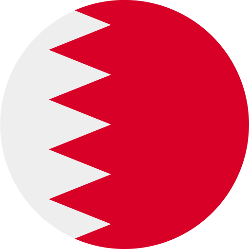
Bahrain (<code>bh</code>)

  

Burundi (<code>bi</code>)

  

Benin (<code>bj</code>)

  

Saint Barthélemy (<code>bl</code>)

  

Bermuda (<code>bm</code>)

  

Brunei (<code>bn</code>)

  

Bolivia (<code>bo</code>)

  

Bonaire (<code>bq-bo</code>)

  

Saba (<code>bq-sa</code>)

  
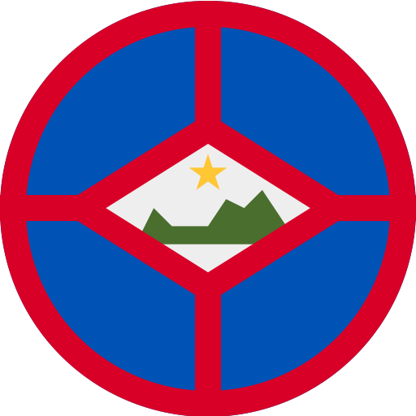
Sint Eustatius (<code>bq-se</code>)

  

Brazil (<code>br</code>)

  
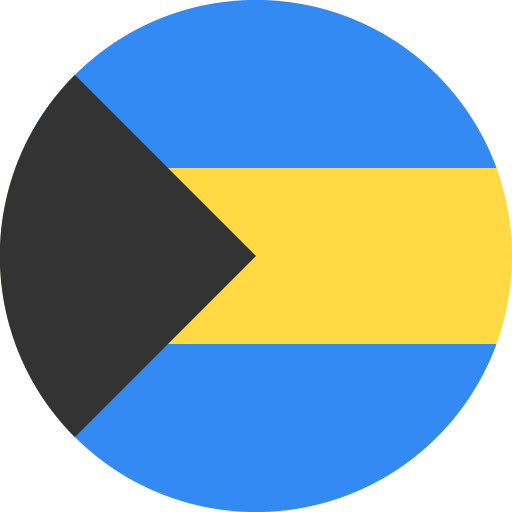
Bahamas (<code>bs</code>)

  

Bhutan (<code>bt</code>)

  
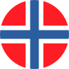
Bouvet Island (<code>bv</code>)

  

Botswana (<code>bw</code>)

  
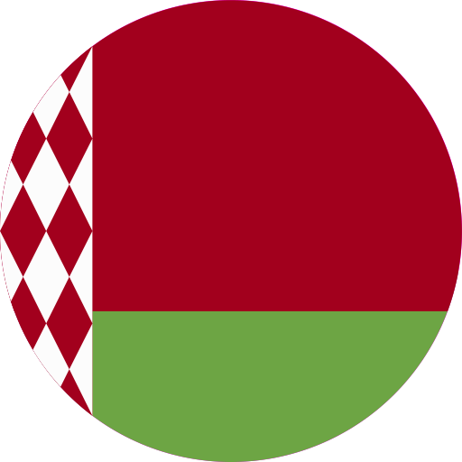
Belarus (<code>by</code>)

  

Belize (<code>bz</code>)

  

Canada (<code>ca</code>)

  
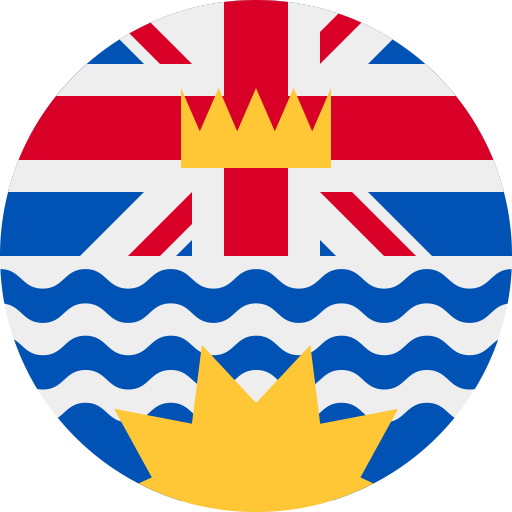
British Columbia (<code>ca-bc</code>)

  
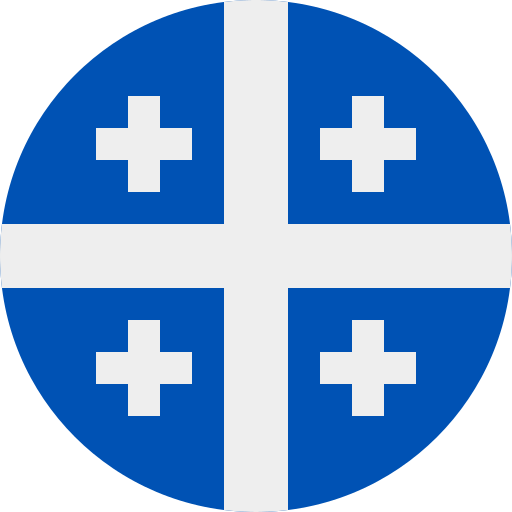
Quebec (<code>ca-qc</code>)

  

Cocos (Keeling) Islands (<code>cc</code>)

  

Congo, Democratic Republic of the (<code>cd</code>)

  
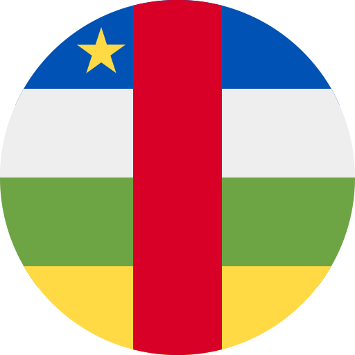
Central African Republic (<code>cf</code>)

  

Congo (<code>cg</code>)

  

Switzerland (<code>ch</code>)

  

Grisons (<code>ch-gr</code>)

  
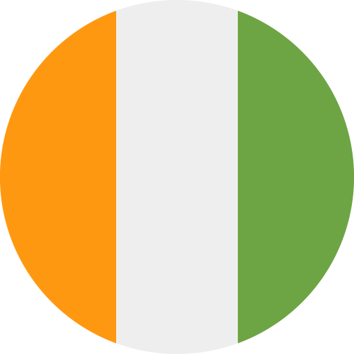
Ivory Coast (<code>ci</code>)

  

Cook Islands (<code>ck</code>)

  
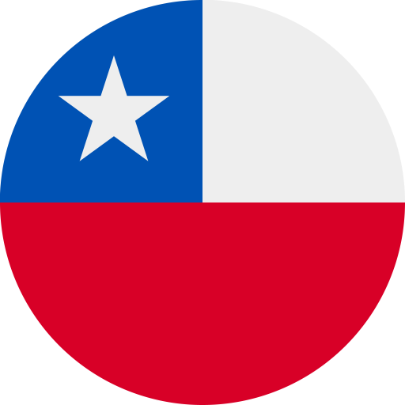
Chile (<code>cl</code>)

  

Cameroon (<code>cm</code>)

  

China (<code>cn</code>)

  

Xinjiang (<code>cn-xj</code>)

  

Colombia (<code>co</code>)

  
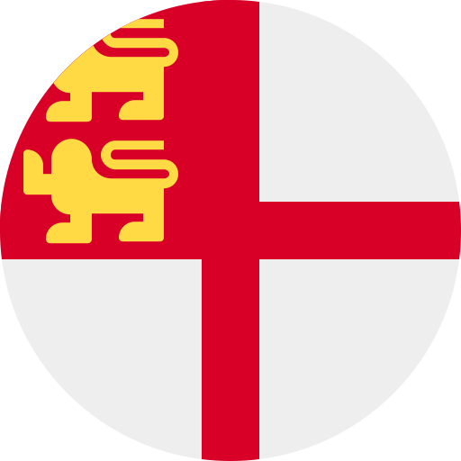
Sark (<code>cq</code>)

  
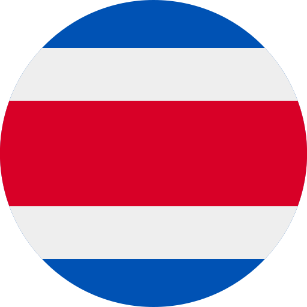
Costa Rica (<code>cr</code>)

  

Cuba (<code>cu</code>)

  
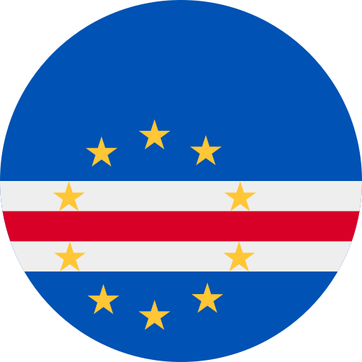
Cabo Verde (<code>cv</code>)

  
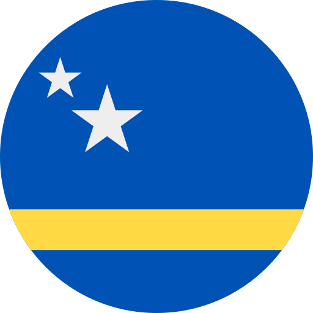
Curaçao (<code>cw</code>)

  

Christmas Island (<code>cx</code>)

  

Cyprus (<code>cy</code>)

  

Czechia (<code>cz</code>)

  
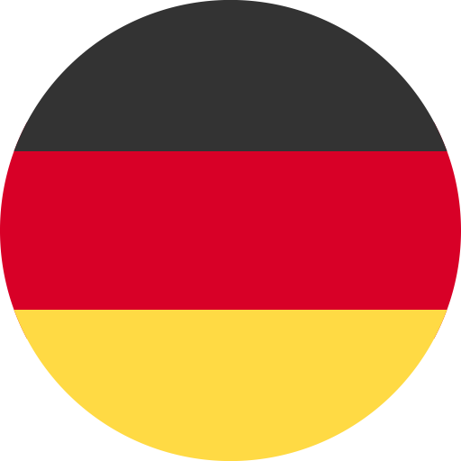
Germany (<code>de</code>)

  
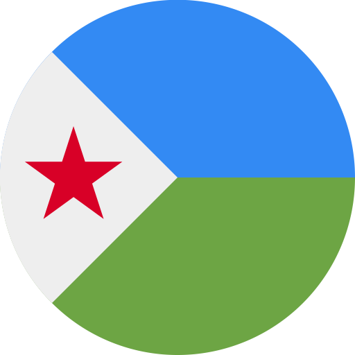
Djibouti (<code>dj</code>)

  
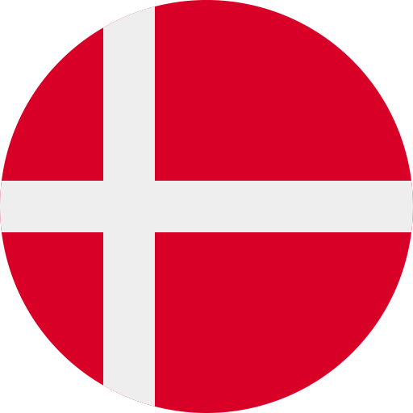
Denmark (<code>dk</code>)

  
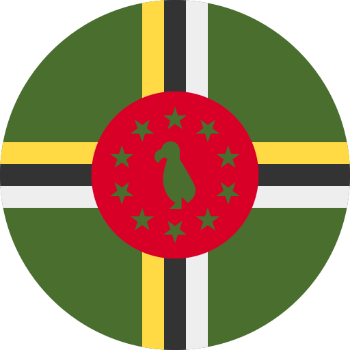
Dominica (<code>dm</code>)

  

Dominican Republic (<code>do</code>)

  

Algeria (<code>dz</code>)

  

Earth

  
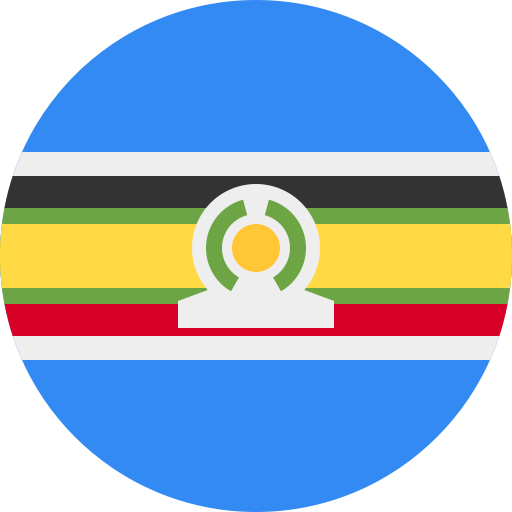
East African Federation

  

Easter Island

  
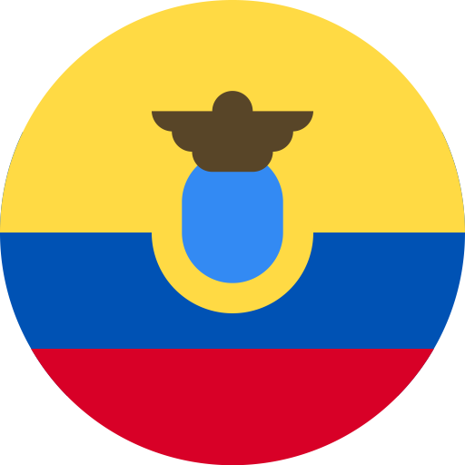
Ecuador (<code>ec</code>)

  

Galápagos (<code>ec-w</code>)

  

Estonia (<code>ee</code>)

  

Egypt (<code>eg</code>)

  
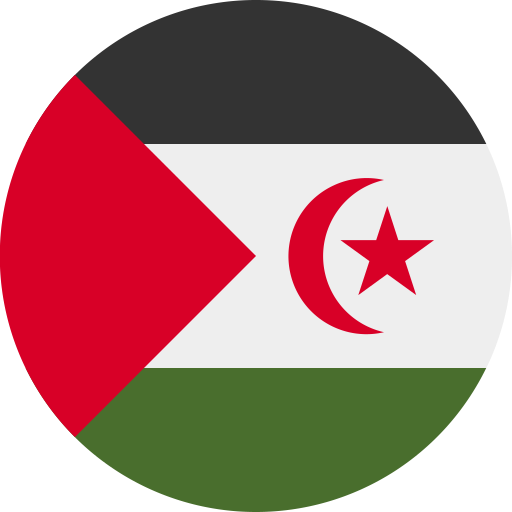
Western Sahara (<code>eh</code>)

  

Eritrea (<code>er</code>)

  

Spain (<code>es</code>)

  
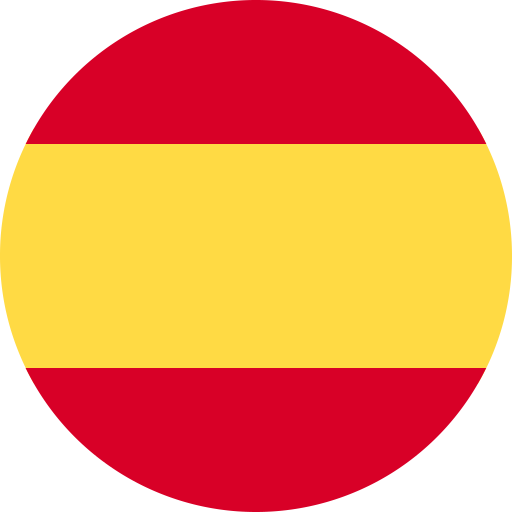
Spain

  
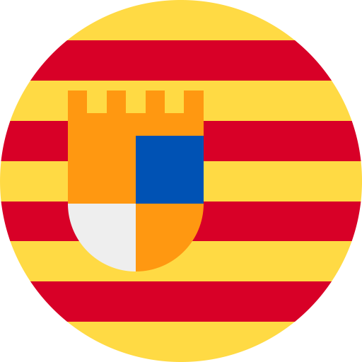
Aragon (<code>es-ar</code>)

  

Ceuta (<code>es</code>)

  
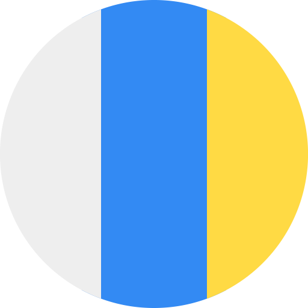
Canary Islands (<code>es-cn</code>)

  

Catalonia (<code>es-ct</code>)

  

Galicia (<code>es-ga</code>)

  

Balearic Islands (<code>es-ib</code>)

  

Melilla (<code>es-ml</code>)

  
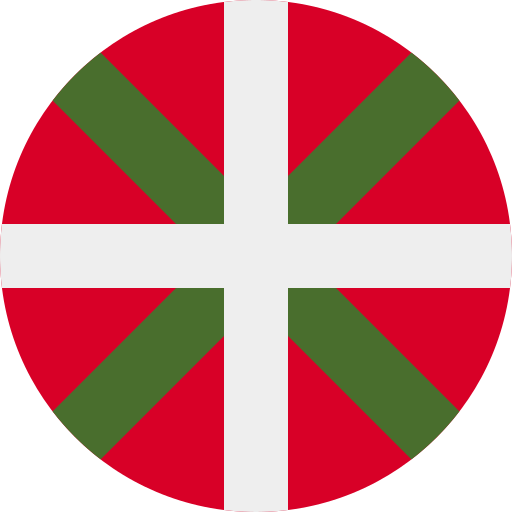
Basque Country (<code>es-pv</code>)

  

Ethiopia (<code>et</code>)

  
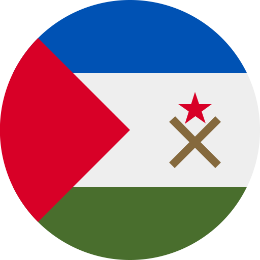
Afar (<code>et-af</code>)

  
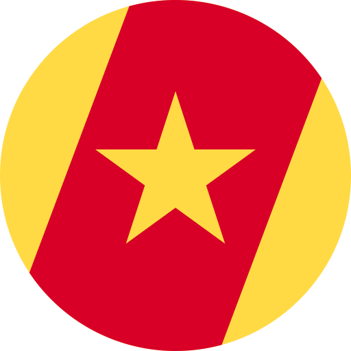
Amhara (<code>et-am</code>)

  
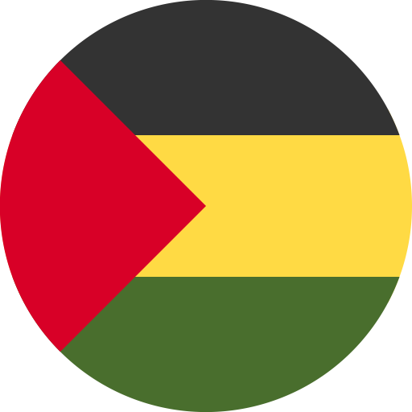
Benishangul-Gumuz (<code>et-be</code>)

  
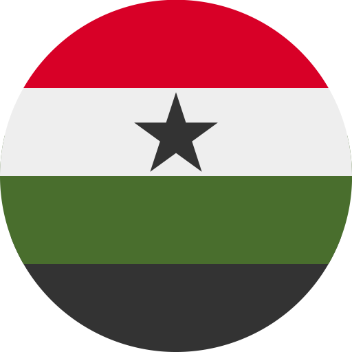
Gambela (<code>et-ga</code>)

  
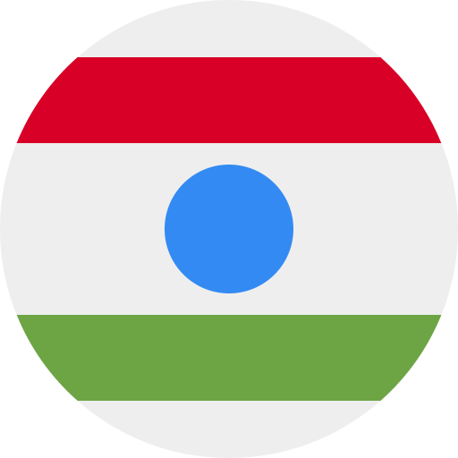
Harari (<code>et-ha</code>)

  
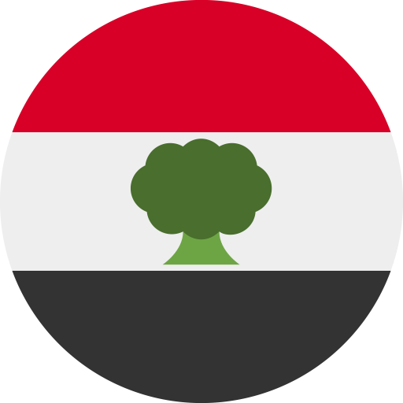
Oromia (<code>et-or</code>)

  
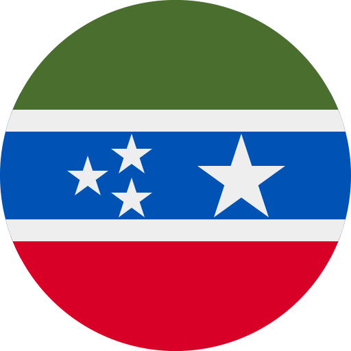
Sidama (<code>et-si</code>)

  
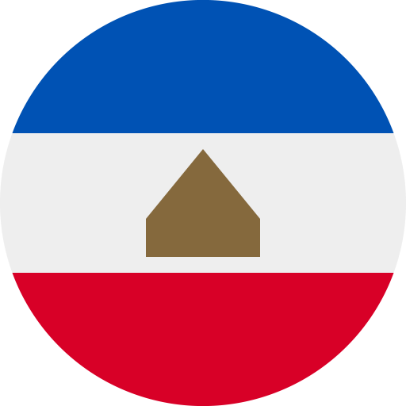
Southern Nations, Nationalities, and Peoples' Region (<code>et-sn</code>)

  
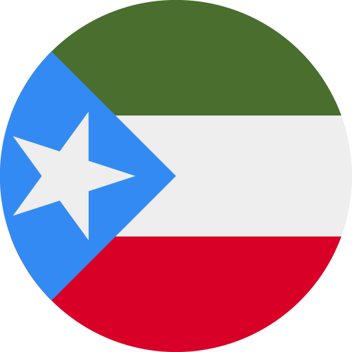
Somali (<code>et-so</code>)

  
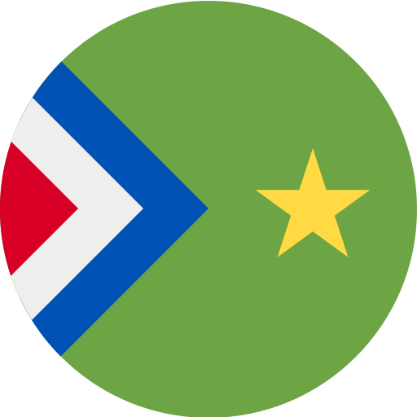
South West Region (<code>et-sw</code>)

  

Tigray (<code>et-ti</code>)

  

European Union (<code>eu</code>)

  

Ewe

  

Finland (<code>fi</code>)

  

Fiji (<code>fj</code>)

  

Falkland Islands (Malvinas) (<code>fk</code>)

  

Micronesia (<code>fm</code>)

  

Faroe Islands (<code>fo</code>)

  

France (<code>fr</code>)

  

Corsica (<code>fr-20r</code>)

  

Brittany (<code>fr-bre</code>)

  

Clipperton Island (<code>fr-cp</code>)

  

Gabon (<code>ga</code>)

  

United Kingdom (<code>gb</code>)

  

Cornwall (<code>gb-con</code>)

  

England (<code>gb-eng</code>)

  

Northern Ireland (<code>gb-nir</code>)

  

Orkney (<code>gb-ork</code>)

  

Scotland (<code>gb-sct</code>)

  

Wales (<code>gb-wls</code>)

  

Grenada (<code>gd</code>)

  

Georgia (<code>ge</code>)

  

Abkhazia (<code>ge-ab</code>)

  

French Guiana (<code>gf</code>)

  

Guernsey (<code>gg</code>)

  

Ghana (<code>gh</code>)

  

Gibraltar (<code>gi</code>)

  

Greenland (<code>gl</code>)

  

Gambia (<code>gm</code>)

  

Guinea (<code>gn</code>)

  

Guadeloupe (<code>gp</code>)

  

Equatorial Guinea (<code>gq</code>)

  

Greece (<code>gr</code>)

  

South Georgia and the South Sandwich Islands (<code>gs</code>)

  

Guatemala (<code>gt</code>)

  

Guam (<code>gu</code>)

  

Guarani

  

Guinea-Bissau (<code>gw</code>)

  

Guyana (<code>gy</code>)

  

Hausa

  

Hong Kong (<code>hk</code>)

  

Hmong

  

Heard Island and McDonald Islands (<code>hm</code>)

  

Honduras (<code>hn</code>)

  

Croatia (<code>hr</code>)

  

Haiti (<code>ht</code>)

  

Hungary (<code>hu</code>)

  

Indonesia (<code>id</code>)

  

West Java (<code>id-jb</code>)

  

Central Java (<code>id-jt</code>)

  

Ireland (<code>ie</code>)

  

Israel (<code>il</code>)

  

Isle of Man (<code>im</code>)

  

India (<code>in</code>)

  

Assam (<code>in-as</code>)

  

Gujarat (<code>in-gj</code>)

  

Karnataka (<code>in-ka</code>)

  

Manipur (<code>in-mn</code>)

  

Mizoram (<code>in-mz</code>)

  

Odisha (<code>in-or</code>)

  

Telangana (<code>in-tg</code>)

  

Tamil Nadu (<code>in-tn</code>)

  

British Indian Ocean Territory (<code>io</code>)

  

Iraq (<code>iq</code>)

  

Kurdistan (<code>iq-kr</code>)

  

Iran (<code>ir</code>)

  

Iceland (<code>is</code>)

  

Italy (<code>it</code>)

  

Piedmont (<code>it-21</code>)

  

Aosta Valley (<code>it-23</code>)

  

Lombardy (<code>it-25</code>)

  

Trentino-Alto Adige (<code>it-32</code>)

  

Veneto (<code>it-34</code>)

  

Friuli Venezia Giulia (<code>it-36</code>)

  

Liguria (<code>it-42</code>)

  

Emilia-Romagna (<code>it-45</code>)

  

Tuscany (<code>it-52</code>)

  

Umbria (<code>it-55</code>)

  

Marche (<code>it-57</code>)

  

Lazio (<code>it-62</code>)

  

Abruzzo (<code>it-65</code>)

  

Molise (<code>it-67</code>)

  

Campania (<code>it-72</code>)

  

Apulia (<code>it-75</code>)

  

Basilicata (<code>it-77</code>)

  

Calabria (<code>it-78</code>)

  

Sicily (<code>it-82</code>)

  

Sardinia (<code>it-88</code>)

  

Jersey (<code>je</code>)

  

Jamaica (<code>jm</code>)

  

Jordan (<code>jo</code>)

  

Japan (<code>jp</code>)

  

Kanuri

  

Kenya (<code>ke</code>)

  

Kyrgyzstan (<code>kg</code>)

  

Cambodia (<code>kh</code>)

  

Kiribati (<code>ki</code>)

  

Kikuyu

  

Comoros (<code>km</code>)

  

Saint Kitts and Nevis (<code>kn</code>)

  

Kongo

  

North Korea (<code>kp</code>)

  

South Korea (<code>kr</code>)

  

Kuwait (<code>kw</code>)

  

Cayman Islands (<code>ky</code>)

  

Kazakhstan (<code>kz</code>)

  

Laos (<code>la</code>)

  

Lebanon (<code>lb</code>)

  

Saint Lucia (<code>lc</code>)

  

Liechtenstein (<code>li</code>)

  

Sri Lanka (<code>lk</code>)

  

Liberia (<code>lr</code>)

  

Lesotho (<code>ls</code>)

  

Lithuania (<code>lt</code>)

  

Luxembourg (<code>lu</code>)

  

Latvia (<code>lv</code>)

  

Libya (<code>ly</code>)

  

Morocco (<code>ma</code>)

  

Malayali

  

Maori

  

Mars (<code>ma</code>)

  

Monaco (<code>mc</code>)

  

Moldova (<code>md</code>)

  

Montenegro (<code>me</code>)

  

Saint-Martin (<code>mf</code>)

  

Madagascar (<code>mg</code>)

  

Marshall Islands (<code>mh</code>)

  

North Macedonia (<code>mk</code>)

  

Mali (<code>ml</code>)

  

Myanmar (<code>mm</code>)

  

Mongolia (<code>mn</code>)

  

Macao (<code>mo</code>)

  

Northern Mariana Islands (<code>mp</code>)

  

Martinique (<code>mq</code>)

  

Mauritania (<code>mr</code>)

  

Montserrat (<code>ms</code>)

  

Malta (<code>mt</code>)

  

Mauritius (<code>mu</code>)

  

Maldives (<code>mv</code>)

  

Malawi (<code>mw</code>)

  

Mexico (<code>mx</code>)

  

Malaysia (<code>my</code>)

  

Mozambique (<code>mz</code>)

  

Namibia (<code>na</code>)

  

New Caledonia (<code>nc</code>)

  

NATO

  

Niger (<code>ne</code>)

  

Norfolk Island (<code>nf</code>)

  

Nigeria (<code>ng</code>)

  

Nicaragua (<code>ni</code>)

  

Netherlands (<code>nl</code>)

  

Friesland (<code>nl-fr</code>)

  

Norway (<code>no</code>)

  

Northern Cyprus

  

Nepal (<code>np</code>)

  

Nauru (<code>nr</code>)

  

Niue (<code>nu</code>)

  

New Zealand (<code>nz</code>)

  

Occitania

  

Olympics

  

Oman (<code>om</code>)

  

Otomi

  

Panama (<code>pa</code>)

  

Peru (<code>pe</code>)

  

French Polynesia (<code>pf</code>)

  

Papua New Guinea (<code>pg</code>)

  

Philippines (<code>ph</code>)

  

Pakistan (<code>pk</code>)

  

Azad Kashmir (<code>pk-jk</code>)

  

Sindh (<code>pk-sd</code>)

  

Poland (<code>pl</code>)

  

Saint Pierre and Miquelon (<code>pm</code>)

  

Pitcairn Islands (<code>pn</code>)

  

Puerto Rico (<code>pr</code>)

  

Palestine (<code>ps</code>)

  

Azores (<code>pt-20</code>)

  

Madeira (<code>pt-30</code>)

  

Portugal (<code>pt</code>)

  

Palau (<code>pw</code>)

  

Paraguay (<code>py</code>)

  

Qatar (<code>qa</code>)

  

Quechua

  

Réunion (<code>re</code>)

  

Romania (<code>ro</code>)

  

Serbia (<code>rs</code>)

  

Russia (<code>ru</code>)

  

Bashkortostan (<code>ru-ba</code>)

  

Chechnya (<code>ru-ce</code>)

  

Chuvashia (<code>ru-cu</code>)

  

Dagestan (<code>ru-da</code>)

  

Donetsk People's Republic (<code>ru-dpr</code>)

  

Komi Republic (<code>ru-ko</code>)

  

Luhansk People's Republic (<code>ru-lpr</code>)

  

Tatarstan (<code>ru-ta</code>)

  

Udmurtia (<code>ru-ud</code>)

  

Rwanda (<code>rw</code>)

  

Saudi Arabia (<code>sa</code>)

  

Sami

  

Solomon Islands (<code>sb</code>)

  

Seychelles (<code>sc</code>)

  

Sudan (<code>sd</code>)

  

Sweden (<code>se</code>)

  

Singapore (<code>sg</code>)

  

Ascension Island (<code>sh-ac</code>)

  

Saint Helena (<code>sh-hl</code>)

  

Tristan da Cunha (<code>sh-ta</code>)

  

Slovenia (<code>si</code>)

  

Svalbard and Jan Mayen (<code>sj</code>)

  

Slovakia (<code>sk</code>)

  

Sierra Leone (<code>sl</code>)

  

San Marino (<code>sm</code>)

  

Senegal (<code>sn</code>)

  

Somalia (<code>so</code>)

  

Somaliland

  

South Ossetia

  

Soviet Union (<code>su</code>)

  

Suriname (<code>sr</code>)

  

South Sudan (<code>ss</code>)

  

São Tomé and Príncipe (<code>st</code>)

  

El Salvador (<code>sv</code>)

  

Sint Maarten (<code>sx</code>)

  

Syria (<code>sy</code>)

  

Eswatini (<code>sz</code>)

  

Turks and Caicos Islands (<code>tc</code>)

  

Chad (<code>td</code>)

  

French Southern Territories (<code>tf</code>)

  

Togo (<code>tg</code>)

  

Thailand (<code>th</code>)

  

Tibet

  

Tajikistan (<code>tj</code>)

  

Tokelau (<code>tk</code>)

  

Timor-Leste (<code>tl</code>)

  

Turkmenistan (<code>tm</code>)

  

Tunisia (<code>tn</code>)

  

Tonga (<code>to</code>)

  

Turkey (<code>tr</code>)

  

Transnistria

  

Trinidad and Tobago (<code>tt</code>)

  

Tuvalu (<code>tv</code>)

  

Taiwan (<code>tw</code>)

  

Tanzania (<code>tz</code>)

  

Ukraine (<code>ua</code>)

  

Uganda (<code>ug</code>)

  

United Nations (<code>un</code>)

  

United States of America (<code>us</code>)

  

Alaska (<code>us-ak</code>)

  

Alabama (<code>us-al</code>)

  

Arkansas (<code>us-ar</code>)

  

Arizona (<code>us-az</code>)

  

California (<code>us-ca</code>)

  

Colorado (<code>us-co</code>)

  

District of Columbia (<code>us-dc</code>)

  

Florida (<code>us-fl</code>)

  

Georgia (<code>us-ga</code>)

  

Hawaii (<code>us-hi</code>)

  

Indiana (<code>us-in</code>)

  

Missouri (<code>us-mo</code>)

  

Mississippi (<code>us-ms</code>)

  

North Carolina (<code>us-nc</code>)

  

New Mexico (<code>us-nm</code>)

  

Rhode Island (<code>us-ri</code>)

  

Tennessee (<code>us-tn</code>)

  

Texas (<code>us-tx</code>)

  

Betsy Ross

  

Confederate battle

  

United States Minor Outlying Islands (<code>um</code>)

  

Uruguay (<code>uy</code>)

  

Uzbekistan (<code>uz</code>)

  

Holy See (Vatican) (<code>va</code>)

  

Saint Vincent and the Grenadines (<code>vc</code>)

  

Venezuela (<code>ve</code>)

  

Virgin Islands (British) (<code>vg</code>)

  

Virgin Islands (U.S.) (<code>vi</code>)

  

Vietnam (<code>vn</code>)

  

Vanuatu (<code>vu</code>)

  

Wallis and Futuna (<code>wf</code>)

  

Wiphala

  

Samoa (<code>ws</code>)

  

Kosovo (<code>xk</code>)

  

&lt;Placeholder&gt;

  

Yemen (<code>ye</code>)

  

Yorubaland

  

Mayotte (<code>yt</code>)

  

Yugoslavia (<code>yu</code>)

  

South Africa (<code>za</code>)

  

Zambia (<code>zm</code>)

  

Zimbabwe (<code>zw</code>)

 